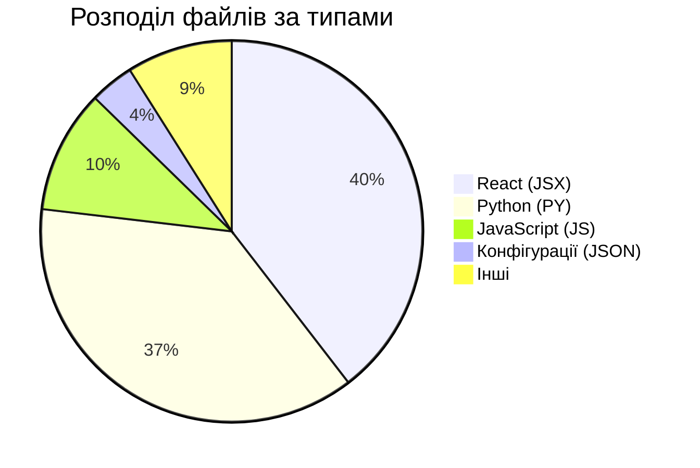

# Архітектурний аналіз проекту FBot_V_2.0

Цей документ містить детальний опис структури проекту **FBot_V_2.0**, метрики коду (кількість файлів, рядків та токенів) та огляд ключових компонентів архітектури.

---

## 📊 Основні метрики проекту

Для аналізу було проскановано весь проект. З підрахунків виключено системні директорії, залежності та збірки (такі як `.venv`, `node_modules`, `.git`, `.idea`, `.vscode`, `__pycache__`, `dist`, а також файли налаштувань на кшталт `package-lock.json`).

| Метрика | Значення | Коментар |
| :--- | :--- | :--- |
| **Всього файлів** | **134** | Лише корисні вихідні файли коду та конфігурацій |
| **Всього рядків коду (LoC)** | **15 578** | Рядки у файлах розширення `.py`, `.jsx`, `.js`, `.json` тощо |
| **Кількість символів** | **793 393** | Включаючи пробіли та символи форматування |
| **Орієнтовна кількість токенів** | **~226 633** | Розраховано для сучасних LLM (наприклад, Gemini / GPT-4) |

> [!NOTE]
> Середня довжина одного токена в коді становить приблизно **3.5 символи**, оскільки код містить багато відступів та специфічного синтаксису, які токенізуються групами. Таким чином, для повного зчитування всього контексту проекту знадобиться близько **226k токенів**.

### 🗂️ Розподіл за типами файлів



* **React компоненти та сторінки (`.jsx`)**: 53 файли (основа клієнтської частини Telegram WebApp)
* **Python скрипти (`.py`)**: 50 файлів (основа бекенду на FastAPI та Telegram боту)
* **JavaScript допоміжні файли (`.js`)**: 14 файлів (утиліти, клієнти API та карти анатомії)
* **Конфігураційні файли (`.json`, `.ini`, `.mako`, `.css`, `.html`, `.md`)**: 17 файлів

---

## 🏗️ Дерево архітектури проекту

Нижче наведено повну структуру проекту з виключенням службових файлів залежностей:

```text
FBot_V_2.0
├── .env
├── .env.example
├── .gitignore
├── alembic/
│   ├── README
│   ├── env.py
│   ├── script.py.mako
│   └── versions/
│       ├── 2b61b00d6315_initial_schema.py
│       └── f0ea4cfc9fb8_change_user_ids_to_biginteger.py
├── alembic.ini
├── app/
│   ├── __init__.py
│   ├── api/
│   │   ├── __init__.py
│   │   └── v1/
│   │       ├── __init__.py
│   │       └── endpoints/
│   │           ├── __init__.py
│   │           ├── admin.py
│   │           ├── ai_ops.py
│   │           ├── cycle.py
│   │           ├── family.py
│   │           ├── gamification.py
│   │           ├── nutrition.py
│   │           ├── trainer.py
│   │           ├── users.py
│   │           └── workouts.py
│   ├── core/
│   │   ├── config.py
│   │   ├── i18n.py
│   │   ├── locales/
│   │   │   ├── de.json
│   │   │   ├── en.json
│   │   │   ├── pl.json
│   │   │   └── uk.json
│   │   └── middleware.py
│   ├── db/
│   │   ├── __init__.py
│   │   ├── connection.py
│   │   ├── models/
│   │   │   ├── __init__.py
│   │   │   ├── base.py
│   │   │   ├── cycle.py
│   │   │   ├── family.py
│   │   │   ├── nutrition.py
│   │   │   ├── social.py
│   │   │   ├── trainer.py
│   │   │   ├── user.py
│   │   │   └── workout.py
│   │   └── repositories/
│   │       ├── __init__.py
│   │       ├── cycle_repo.py
│   │       ├── family_repo.py
│   │       ├── fitness_repo.py
│   │       ├── food_repo.py
│   │       ├── social_repo.py
│   │       ├── trainer_repo.py
│   │       ├── user_repo.py
│   │       └── workout_repo.py
│   └── services/
│       ├── __init__.py
│       └── ai/
│           ├── __init__.py
│           ├── analytics_ai.py
│           ├── cycle_ai.py
│           ├── llm_connector.py
│           ├── nutrition_ai.py
│           ├── strength_ai.py
│           └── workout_ai.py
├── bot.py
├── clear_db.py
├── frontend/
│   ├── .gitignore
│   ├── README.md
│   ├── eslint.config.js
│   ├── index.html
│   ├── package.json
│   ├── public/
│   │   ├── img/
│   │   │   └── desktop.ini
│   │   └── uploads/
│   │       ├── avatars/
│   │       └── videos
│   ├── src/
│   │   ├── App.jsx
│   │   ├── api/
│   │   │   └── client.js
│   │   ├── assets/
│   │   ├── components/
│   │   │   ├── BottomNav.jsx
│   │   │   ├── Button.jsx
│   │   │   ├── Card.jsx
│   │   │   ├── ErrorBoundary.jsx
│   │   │   ├── Input.jsx
│   │   │   ├── InteractiveCanvas.jsx
│   │   │   ├── Layout.jsx
│   │   │   ├── Loader.jsx
│   │   │   ├── ModalProvider.jsx
│   │   │   ├── Toast.jsx
│   │   │   └── modals/ (30+ модальних вікон для фітнесу, тренувань, харчування, гейміфікації тощо)
│   │   ├── hooks/
│   │   │   └── useTelegram.js
│   │   ├── index.css
│   │   ├── main.jsx
│   │   ├── pages/
│   │   │   ├── Admin.jsx
│   │   │   ├── Coach.jsx
│   │   │   ├── Cycle.jsx
│   │   │   ├── Dashboard.jsx
│   │   │   ├── Gamification.jsx
│   │   │   ├── LandingPage.jsx
│   │   │   ├── NoAccess.jsx
│   │   │   ├── Nutrition.jsx
│   │   │   ├── Onboarding.jsx
│   │   │   ├── Profile.jsx
│   │   │   ├── Progress.jsx
│   │   │   └── Team.jsx
│   │   └── store/
│   │       ├── useModalStore.js
│   │       ├── useStore.js
│   │       ├── useTimerStore.js
│   │       ├── useToastStore.js
│   │       └── useWorkoutStore.js
│   └── vite.config.js
├── server.py
└── static/
    ├── img/
    └── js/
        └── anatomy/
            ├── anatomy_mapper.js
            ├── bodyBack.js
            ├── bodyFemaleBack.js
            ├── bodyFemaleFront.js
            └── bodyFront.js
```

---

## 🔎 Детальний опис архітектурних шарів

Код проекту демонструє продуману архітектуру сучасного фітнес-застосунку з інтеграцією штучного інтелекту, що працює як **Telegram WebApp**. Його можна розділити на 4 основні архітектурні шари:

### 1. Бекенд (FastAPI & Telegram Bot)
* **`server.py`**: Запуск REST API сервера на базі FastAPI.
* **`bot.py`**: Інтеграція Telegram Bot API для взаємодії з користувачем, відправки нотифікацій та запуску WebApp.
* **`app/api/v1/endpoints/`**: Контролери, що обробляють запити від фронтенду. Тут реалізовано логіку для тренувань, харчування, циклів, гейміфікації та адміністрування.

### 2. Доступ до даних (Data Access Layer)
* **`app/db/models/`**: Опис реляційних моделей SQLAlchemy (користувачі, тренування, харчування, соціальні зв’язки тощо).
* **`app/db/repositories/`**: Реалізація патерну *Repository* для чистого розділення логіки запитів до бази даних від бізнес-логіки контролерів.
* **`alembic/`**: Контроль версій та міграції бази даних.

### 3. Шар штучного інтелекту (AI & Services)
* **`app/services/ai/`**: Модуль містить інтеграції для розумної аналітики, автоматичної побудови планів тренувань (`workout_ai.py`), аналізу харчування (`nutrition_ai.py`), розрахунку силових показників (`strength_ai.py`) та жіночого циклу (`cycle_ai.py`). Зв'язок із LLM здійснюється через `llm_connector.py`.

### 4. Клієнтська частина (React Frontend / Telegram WebApp)
* **Vite React SPA**: Швидка збірка та оптимізований рендеринг.
* **Локалізація**: Бекенд підтримує декілька мов (`locales/` містить `uk.json`, `en.json`, `de.json`, `pl.json`).
* **Керування станом (State Management)**: Використання сучасного реактивного сховища (`store/` з файлами `useWorkoutStore.js`, `useStore.js` тощо).
* **Складна UI взаємодія**:
  * Величезна кількість модальних вікон (`components/modals/`) для гнучкої взаємодії (заміна вправ, ведення ваги, перегляд рецептів, сканування Fuelcast тощо).
  * Інтерактивна анатомічна карта (`static/js/anatomy/`) з файлами для відображення м'язів спереду та ззаду для чоловіків та жінок (`bodyFront.js`, `bodyFemaleFront.js` тощо).

---

## 📈 Топ-5 найбільших файлів за кількістю рядків

1. 📂 [index.css](file:///c:/Users/HP/Desktop/FBot_V_2.0/frontend/src/index.css) — **2 243 рядків** (*~14.5k токенів*). Містить всі стилі інтерфейсу застосунку.
2. 📂 [Progress.jsx](file:///c:/Users/HP/Desktop/FBot_V_2.0/frontend/src/pages/Progress.jsx) — **564 рядків** (*~8.2k токенів*). Сторінка візуалізації прогресу та графіків.
3. 📂 [Nutrition.jsx](file:///c:/Users/HP/Desktop/FBot_V_2.0/frontend/src/pages/Nutrition.jsx) — **448 рядків** (*~8.7k токенів*). Сторінка логування та аналізу харчування користувача.
4. 📂 [users.py](file:///c:/Users/HP/Desktop/FBot_V_2.0/app/api/v1/endpoints/users.py) — **432 рядків** (*~5.1k токенів*). Контролер користувацьких профілів та авторизації.
5. 📂 [gamification.py](file:///c:/Users/HP/Desktop/FBot_V_2.0/app/api/v1/endpoints/gamification.py) — **407 рядків** (*~6.9k токенів*). Логіка ігрових досягнень, рівнів та дуелей.
